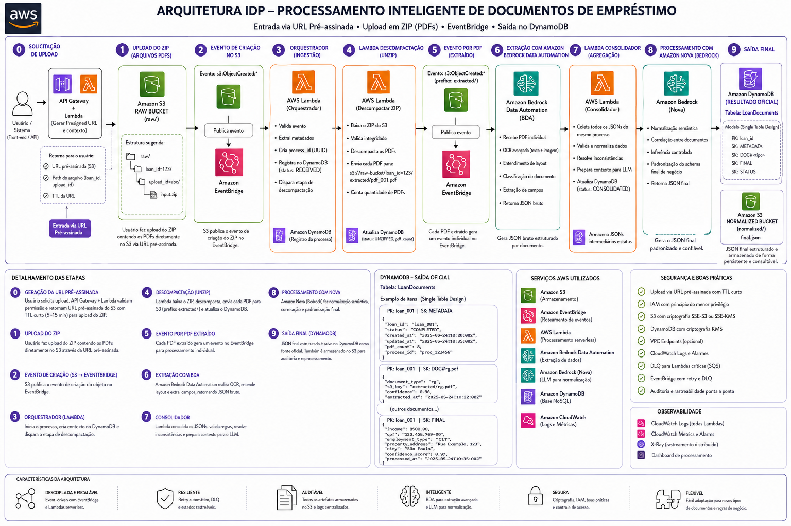

# LeiturAI - Plataforma Serverless para Análise Inteligente de Documentos

## Visão Geral

O LeiturAI é uma plataforma serverless desenvolvida para automatizar a análise de documentos não estruturados utilizados em operações de crédito. A solução permite a ingestão, extração, processamento e armazenamento de informações provenientes de documentos PDF utilizando uma arquitetura orientada a eventos na AWS.

O projeto foi desenvolvido durante um Hackathon com o objetivo de reduzir o esforço manual envolvido na análise documental e acelerar a tomada de decisão em processos de avaliação de crédito.

---

## Problema de Negócio

No mercado de análise de crédito, uma grande quantidade de informações relevantes está distribuída em documentos extensos e não estruturados. A análise manual desses documentos torna o processo lento, operacionalmente custoso e difícil de escalar.

As empresas precisam transformar rapidamente grandes volumes de documentos em informações estruturadas que apoiem decisões mais ágeis e assertivas.

---

## Solução

O LeiturAI oferece um fluxo completo de processamento de documentos que:

* Recebe arquivos por meio de URLs pré-assinadas;
* Processa arquivos ZIP contendo documentos PDF;
* Extrai e interpreta informações presentes nos documentos;
* Gera dados estruturados para consumo por sistemas de negócio;
* Armazena os resultados processados;
* Disponibiliza monitoramento e observabilidade da solução.

---

## Arquitetura

> Inserir a imagem da arquitetura abaixo.



---

## Serviços AWS Utilizados

* Amazon API Gateway
* AWS Lambda
* Amazon S3
* Amazon EventBridge
* Amazon DynamoDB
* Amazon CloudWatch
* Amazon Bedrock Data Automation
* AWS IAM

---

## Fluxo da Solução

1. O cliente solicita uma URL para upload.
2. O API Gateway invoca uma função Lambda.
3. A Lambda gera uma URL pré-assinada do Amazon S3.
4. O cliente envia um arquivo ZIP contendo documentos PDF.
5. O Amazon S3 gera um evento capturado pelo EventBridge.
6. Uma Lambda descompacta os arquivos enviados.
7. Os documentos PDF são processados de forma assíncrona.
8. As informações estruturadas são persistidas no DynamoDB.
9. Logs e métricas ficam disponíveis no CloudWatch.

---

## Estrutura do Projeto

```text
docs/
diagrams/
examples/
infrastructure/
lambdas/
```

---

## Principais Características

* Arquitetura 100% Serverless;
* Processamento orientado a eventos;
* Escalabilidade automática;
* Baixo custo operacional;
* Desacoplamento entre componentes;
* Observabilidade nativa;
* Upload seguro de arquivos por meio de URLs pré-assinadas.

---

## Evoluções Futuras

* Infraestrutura como Código utilizando AWS SAM ou Terraform;
* Autenticação e autorização utilizando Amazon Cognito;
* Processamento assíncrono com Amazon SQS;
* Dashboard analítico utilizando Amazon QuickSight;
* Pipeline de CI/CD utilizando GitHub Actions.

---

## Equipe

Projeto desenvolvido durante um Hackathon com foco na aplicação de tecnologias cloud-native e serverless para resolver desafios reais de análise documental no mercado de crédito.
